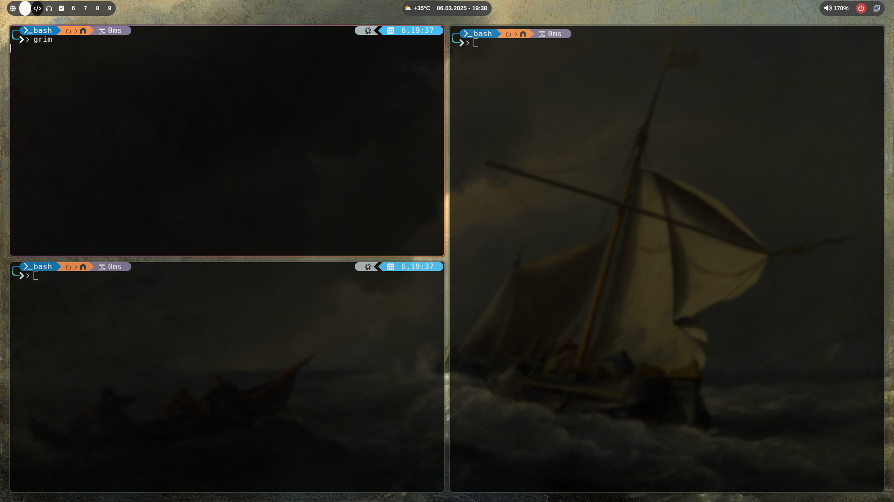

## Work in progress

This is my simple nixos config. Still some stuff to polish so I don't recommend cloning.

Feel free to pick up some inspo for your dotfiles tho.

- cd into repo folder after cloning.
- cp nixos to /etc/nixos
- cp home-manager to ~/.config/home-manager
- cp Wallpapers to ~/
- rebuild nixos: sudo nixos-rebuild switch
- apply home-manager config: home-manager switch

